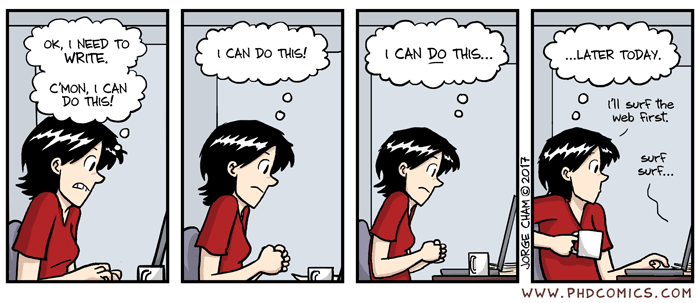

```{r setup, include=FALSE}
options(htmltools.dir.version = FALSE)
```

```{r xaringan-all, echo=FALSE}
library(countdown)
library(xaringan)
library(xaringanExtra)
library(knitr)
xaringanExtra::use_broadcast()
xaringanExtra::use_scribble()
#xaringanExtra::use_slide_tone()
xaringanExtra::use_search(show_icon = TRUE)
xaringanExtra::use_freezeframe()
xaringanExtra::use_clipboard()
xaringanExtra::use_fit_screen()
xaringanExtra::use_extra_styles(
  hover_code_line = TRUE,         
  mute_unhighlighted_code = TRUE  
)
```

class: inverse, center, title-slide, middle

<style>
.title-slide .remark-slide-number {
  display: none;
}
</style>

```{r load_packages, message=FALSE, warning=FALSE, include=FALSE}
library(fontawesome)
```

# Thesis study + Q and A

### Andy MacLachlan

### 14/04/2021 (updated: `r format(Sys.time(), "%d/%m/%Y")`)

`r fa("paper-plane", fill = "white")`[a.maclachlan@ucl.ac.uk](mailto:a.maclachlan@ucl.ac.uk)
`r fa("twitter", fill = "white")`[andymaclachlan](https://twitter.com/andymaclachlan)
`r fa("github", fill = "white")`[andrewmaclachlan](https://github.com/andrewmaclachlan)
`r fa("map-marker", fill = "white")`[Centre for Advanced Spatial Analysis, UCL](https://www.ucl.ac.uk/bartlett/casa/)

<a href="https://github.com/andrewmaclachlan" class="github-corner" aria-label="View source on GitHub"><svg width="80" height="80" viewBox="0 0 250 250" style="fill:#fff; color:#151513; position: absolute; top: 0; border: 0; left: 0; transform: scale(-1, 1);" aria-hidden="true"><path d="M0,0 L115,115 L130,115 L142,142 L250,250 L250,0 Z"></path><path d="M128.3,109.0 C113.8,99.7 119.0,89.6 119.0,89.6 C122.0,82.7 120.5,78.6 120.5,78.6 C119.2,72.0 123.4,76.3 123.4,76.3 C127.3,80.9 125.5,87.3 125.5,87.3 C122.9,97.6 130.6,101.9 134.4,103.2" fill="currentColor" style="transform-origin: 130px 106px;" class="octo-arm"></path><path d="M115.0,115.0 C114.9,115.1 118.7,116.5 119.8,115.4 L133.7,101.6 C136.9,99.2 139.9,98.4 142.2,98.6 C133.8,88.0 127.5,74.4 143.8,58.0 C148.5,53.4 154.0,51.2 159.7,51.0 C160.3,49.4 163.2,43.6 171.4,40.1 C171.4,40.1 176.1,42.5 178.8,56.2 C183.1,58.6 187.2,61.8 190.9,65.4 C194.5,69.0 197.7,73.2 200.1,77.6 C213.8,80.2 216.3,84.9 216.3,84.9 C212.7,93.1 206.9,96.0 205.4,96.6 C205.1,102.4 203.0,107.8 198.3,112.5 C181.9,128.9 168.3,122.5 157.7,114.1 C157.9,116.9 156.7,120.9 152.7,124.9 L141.0,136.5 C139.8,137.7 141.6,141.9 141.8,141.8 Z" fill="currentColor" class="octo-body"></path></svg></a><style>.github-corner:hover .octo-arm{animation:octocat-wave 560ms ease-in-out}@keyframes octocat-wave{0%,100%{transform:rotate(0)}20%,60%{transform:rotate(-25deg)}40%,80%{transform:rotate(10deg)}}@media (max-width:500px){.github-corner:hover .octo-arm{animation:none}.github-corner .octo-arm{animation:octocat-wave 560ms ease-in-out}}</style>

---
class: inverse, center, middle



---
class: inverse, center, middle

# Possible headings

---

# Headings - Introduction

Usually very few headings

- Introduction

- Research question

- Objectives 

- Thesis outline
---
class: inverse, center, middle
# Introduction = clearly show the **research gap** that will be expanded on in the literature review
---

#Literature review

Depends on the topic, but usually some commonalities: 

--

.pull-left[

Can features of the built environment be used to predict the locations of pedestrian crashes at the street level in Uptown Charlotte, North Carolina?


* Benefits of Walking
* Pedestrian Safety Pandemic 
  * Pedestrian Policies, Globally and Locally
  * Factors Influencing Pedestrian Safety
* Pedestrian Data Dilemmas
* Methods for Considering Pedestrian Safety
]

--

.pull-right[
to determine how to prioritize road segments for investments in segregated cycling infrastructure, doing so in a way that makes optimal use of limited budgets

- What Effects the Decision to Cycle
  - Existence of Segregated Cycling Infrastructure
  - Directness
  - Continuity and Density
  - Overarching Policies
- Planning Cycling Networks
  - Connected Components
  - Optimization
  - Directness
  - Optimization based on Community Detection
- Underlying Ethical Principles
]

---
# Literature review common headings

You will have you research topic BUT what are the policies, studies or data that surround it:

--

* What effects it?

--

* Who decided that it is this way? What was it based on?

--

* How is it defined? Do definitions vary based on location or other factors?

--

* How is that measured? 

--

* How has it been studied before?

--

You will likely have a 2 or 3 main headings within the literature review and sub headings exploring specifics under them

---
class: inverse, center, middle
# Literature review = what you are contributing (towards the end of the literature review), based on what has been done 

#+ Novel: What is new? 
---
# Methdology headings - study area

Start with a high level overview

**Do you need a study area chapter or section within the methodology**

--

* Is your study area unique  

--

* Are you trying to address a specific policy or metropolitan challenge that is associated with that city

--

* Does it have a history of trying to solve the issue or failures in attempting to address it

--

* Is there certain or specific data for your city? 

--

* Has there been a sudden local interest from policy 

--

* e.g.: Charlotte WALKS Pedestrian Plan, The London Plan 

--

You probably don't need one if you are creating a method
---
# Methodology headings

.pull-left[

Think logically, a reader needs to know:

* What data you have access to / used

* Any data processing you have done

* Any ethical concerns about the data

* What method(s) you will use

* How you use both together 
]

--

.pull-right[

* Study Area

* Data

* Ethical evaluation (mostly focus on data)

* Methodological Overview
  * Random forest 
  * Negative Binomial Regression
  * Prediction and Interpretation 

]

---

# Results headings

Some dissertations don't have any sub headings. Others do...

An easy way to have sub headings here is to adapt your objectives ... that usually focus on data results **or** look back at your literature review headings

--

.pull-left[
* OD Pair Performance
* Potential Cycling Demand
* Routing
* Prioritizing Road Segments for Segregated Infrastructure
  * Algorithm 1: Growth From One Origin
  * Algorithm 2: Utilitarian Growth
  * Algorithm 3: Egalitarian Growth (Focus on Fair Distribution of Resources)
  * Connectivity
]

--

.pull-right[
- What Effects the Decision to Cycle
  - Existence of Segregated Cycling Infrastructure
  - Directness
  - Continuity and Density
  - Overarching Policies
- Planning Cycling Networks
  - Connected Components
  - Optimization
  - Directness
  - Optimization based on Community Detection
- Underlying Ethical Principles
]

--

Other students who have developed a model have then applied it to different areas with a sub section for each in the results section.

---
class: inverse, center, middle
# The discussion is the *most* important part of your thesis

---
# Discussion headings 

An easy way to do this...again look back at your research question and objectives, can you form sub headings from them. Some past students did exactly this...

.pull-left[

* Interpretation of Model

* Assessment of Variables

* The Need for Pedestrian Volume Data

* Pedestrian Safety Policy Contextualization

* Limitations]

--

.pull-right[
* What features of the built environment are thought to influence pedestrian safety, and can our understanding of these relationships be strengthened?
* What are the challenges when it comes to studying pedestrian safety in terms of the lack of available pedestrian data? Does Charlotte collect and make public the data required for this type of analysis?
* How can the findings of this research be used to improve upon existing policy or urban design strategies by highlighting targeted areas and adjustments for improved pedestrian safety?
]

---
# Remember the funnel 

* Start discussing you results in relation to literature

* Build outwards to specific policy recommendations 

* Frame them within limitations 

---
class: inverse, center, middle
# A discussion **does NOT JUST** talk about results and is **NOT JUST** limitations

---

# Discussion headings 

An easy way to do this...again look back at your research question and objectives, can you form sub headings from them. Some past students did exactly this...

.pull-left[
* Potential Cycling Demand
* Routing
* Community Detection
* Algorithms
]

--

.pull-right[
- What Effects the Decision to Cycle
  - Existence of Segregated Cycling Infrastructure
  - Directness
  - Continuity and Density
  - Overarching Policies
- Planning Cycling Networks
  - Connected Components
  - Optimization
  - Directness
  - Optimization based on Community Detection
- Underlying Ethical Principles
]

---
# Discussion - other headings to consider

These could from sub sub headings based on other sections and vary on research:

--

* Research significance = **NOVEL**

--

* Global development goals

--

* Local policy

--

* Academic research

--

* Transferability

---
class: inverse, center, middle
# Conclusion vs abstract 


---

# The Abstact 

The abstract is always much shorter and can be created by following a few simple steps:

.pull-left[
* State what challenge you are trying to solve, perhaps with a sentence or two of context before it.

* State what method you use

* State what the results show

* State what the paper recommends based on the data

]

--

.pull-right[
* Through global and local policies, improved walkability and pedestrian safety are being promoted as important transportation objectives

* This study used the methodology proposed by ...

* The results show that current, city-wide pedestrian
safety policies may not be helpful

* This paper advocates for enhanced pedestrian count programs in Charlotte ..[a bit vague]
]


---
# The Conclusion

The conclusion is longer and should reflect on if the aim(s) and objectives were met. It is similar to the abstract but has much more detail. 

.pull-left[

* restate what you set out to investigate

* summarise how you achieved the

* summarise the results 

* reflect if you meet the aims + objectives

* state the importance 

* give some high level, specifc, recommendations]

--

.pull-right[

* This research employs a comparative case study approach to investigate data production and maintenance in humanitarian mapping campaigns

* The recently developed OSHDB API (Raifer et al. 2019) was applied to efficiently process

* This finding suggests that the OSM data in these areas is at a greater risk of becoming out of date

* It is hoped that this work will serve as a foundation for future investigations into data maintenance in humanitarian mapping.

* The results of this work also show that the data produced during the selected
humanitarian campaigns has been poorly maintained over time

]

---
class: inverse, center, middle
# In this example I would have liked to see some more actionable recommedations as opposed to..

>  Future work should also more comprehensively investigate appropriate baseline levels of maintenance activity, for example by following the approach detailed here to quantify maintenance in areas of known high data quality

---
# Set up your dissertation document

---


# Next week

* How to set up your dissertation document

  * Word (briefly)

  * Bookdown (using RMarkdown) - https://andrewmaclachlan.github.io/CASA-MSc-thesis/

* Any requests on Slack

* Q and A
